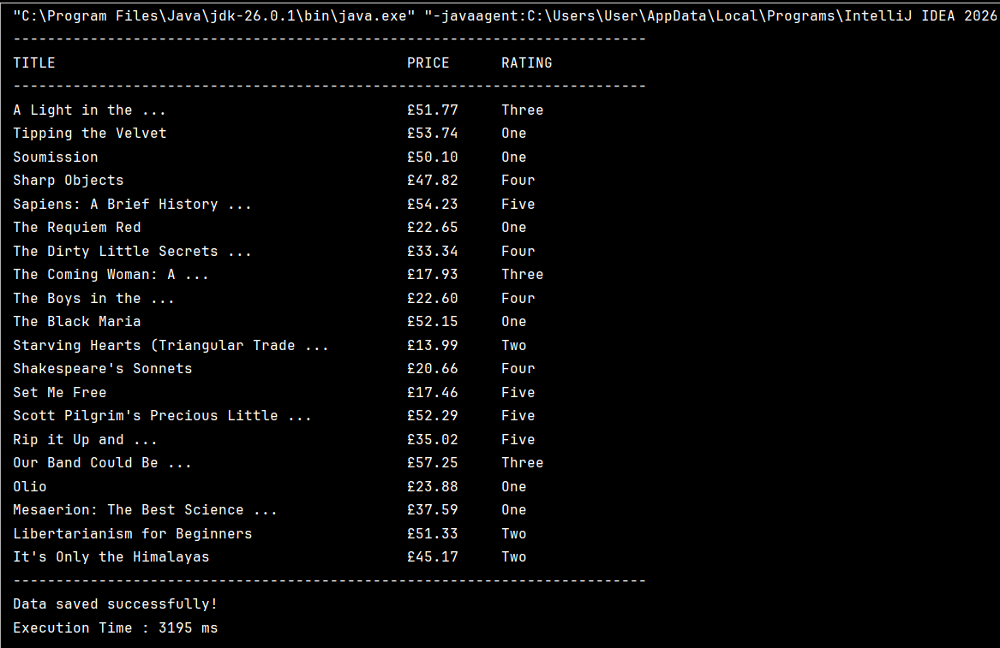
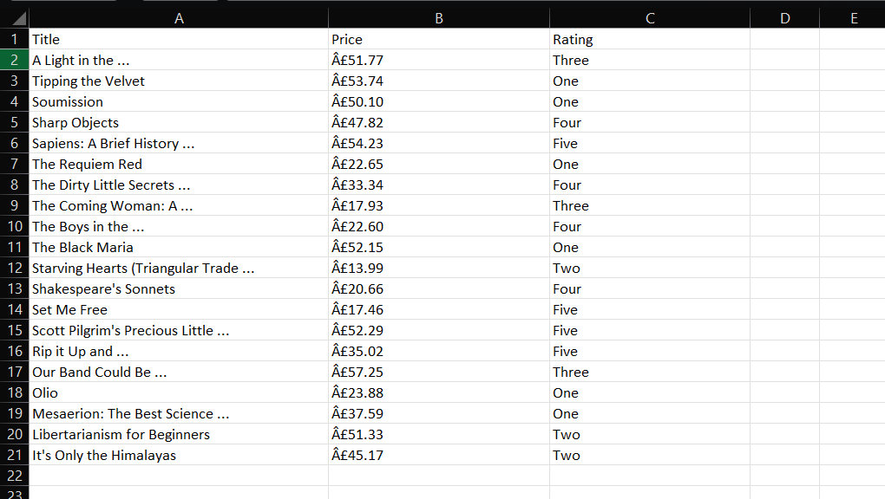

# Web Scraper using Java & Jsoup
## Task 04 - Web Scraper

A Java-based web scraping application that extracts book information from the **Books to Scrape** website and exports the data into a CSV file.

---

## 🚀 Features

- 📖 Extracts book titles
- 💷 Extracts book prices
- ⭐ Extracts book ratings
- 📄 Exports scraped data to a CSV file
- 📊 Displays formatted output in the console
- ⏱ Measures execution time

---

## 🛠️ Technologies Used

- Java (JDK 26)
- Jsoup
- Maven
- IntelliJ IDEA
- Git & GitHub

---

## 📂 Project Structure

```
SCT_SD_04_WebScraper
│── src
│   └── main
│       └── java
│           └── org.example
│               └── Main.java
│── products.csv
│── pom.xml
│── README.md
```

---

## 🌐 Website Used

**Books to Scrape**

https://books.toscrape.com/

This website is specifically designed for practicing web scraping.

---

## 📊 Sample Output

### Console Output



---

### CSV Output



---

## ⚙️ How to Run

1. Clone the repository

```
git clone https://github.com/your-username/SCT_SD_04_WebScraper.git
```

2. Open the project in IntelliJ IDEA.

3. Ensure Maven dependencies are installed.

4. Run `Main.java`.

5. The scraped data will be saved as:

```
products.csv
```

---

## 📚 Concepts Learned

- Web Scraping using Jsoup
- HTML Parsing
- CSS Selectors
- Java File Handling
- CSV File Generation
- Exception Handling
- Try-with-Resources
- Maven Dependency Management

---

## 🔮 Future Improvements

- Export data to Excel (.xlsx)
- Store data in MySQL
- Scrape multiple pages automatically
- Add filtering options
- Build a JavaFX desktop interface

---

## 👩‍💻 Author

**Manpreet Kaur**

B.Tech Computer Science Student

Currently learning Java, Data Structures & Algorithms, and Software Development through hands-on projects.

---
